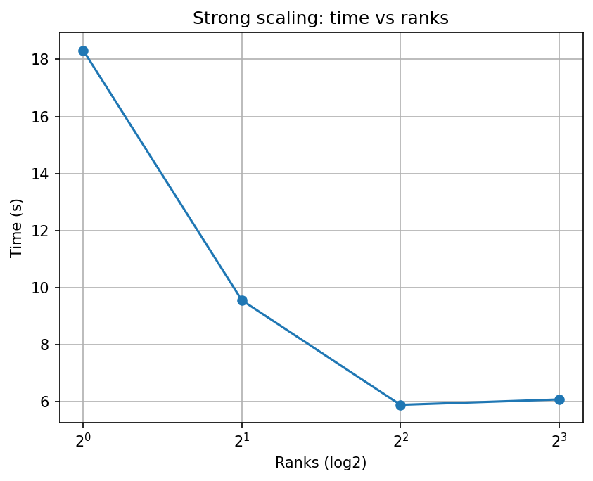
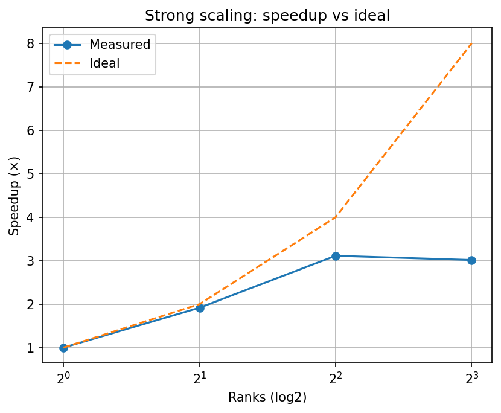
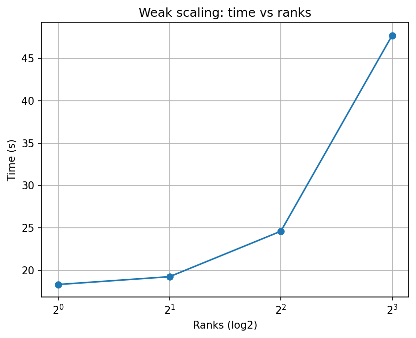
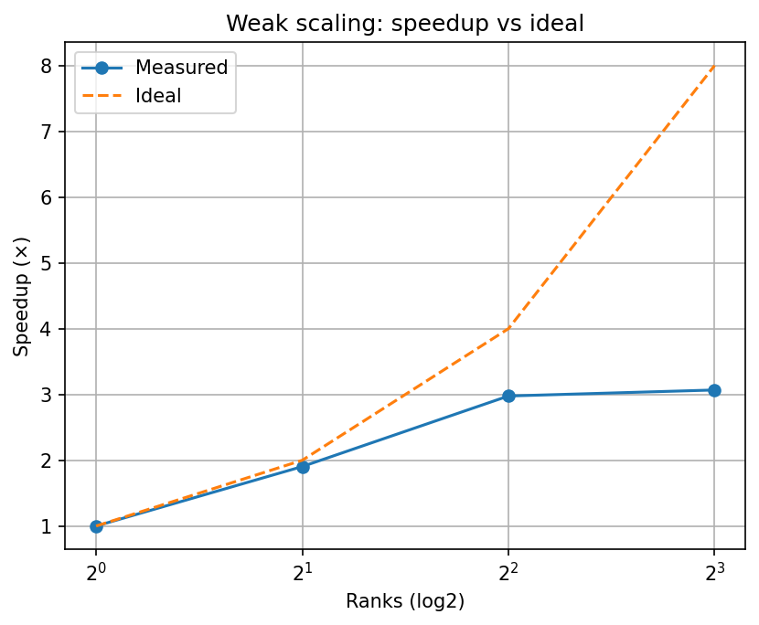

# MPI Poisson 2D — Strong & Weak Scaling Demo

## Overview

Implemented a simple **2D Poisson solver** using **Jacobi iteration** with **MPI halo exchanges**. It is designed to explore distributed-memory parallelism, scaling behavior.

The solver:
- Discretizes the 2D Poisson equation on a Cartesian grid.
- Uses a 5-point Jacobi stencil for iteration.
- Exchanges halos between MPI ranks at every step.

## Goals

- Gain practical experience with **MPI** and **domain decomposition**.
- Implement a baseline **Jacobi solver** for a structured 2D grid.  
- Explore **strong scaling** (fixed global problem size) and **weak scaling** (fixed local size per rank).
- Provide a clean workflow for HPC demos.

## Approach

- The structure of the project:
  - `src/` → MPI C++17 source code (`poisson.cpp`, `main.cpp`).  
  - `scripts/` → helper scripts for scaling runs and plotting.  
  - `results/` → CSV outputs and plots.  
  - `CMakeLists.txt` → build system.  
- Scaling runs are scripted via `run_strong.sh` and `run_weak.sh`.  
- Plotting handled by `plot_scaling.py`, which produces:
  - **Time vs ranks**
  - **Speedup vs ideal**
  - **Weak scaling curves**

### Details

- Iterative method: **Jacobi relaxation**.  
- Communication: blocking `MPI_Sendrecv` with manual halo packing.  
- Input parameters:
  - `--nx`, `--ny` → global grid size (strong scaling).  
  - `--local` → switch to per-rank local grid size (weak scaling).  
  - `--tol`, `--maxiter` → convergence tolerance and iteration cap.  
- CSV output (when `POISSON2D_CSV=1`):
  ```
  mode, nprocs, px, py, nxg, nyg, nxl, nyl, iters, time_s, residual
  ```

## Results

- **Strong scaling**: speedup grows with ranks, but efficiency drops due to communication.  
- **Weak scaling**: runtime increases modestly with ranks due to halo overhead.  
- **Plots**:  
  - `results/plots-1.png` — Strong scaling time vs ranks.  
  - `results/plots-2.png` — Speedup vs ideal.

<p align="center">
  
  
</p>

  - `results/plots-3.png` — Weak scaling time vs ranks.  
  - `results/plots-4.png` — Speedup vs ideal.

<p align="center">
  
  
</p>
 
The “ideal” is the straight orange dashed diagonal line (speedup = number of processes). Measured lines will always fall below it because of **halo communication** and **Jacobi’s memory-bound nature**.

## Conclusions

- Jacobi + MPI is simple but **communication-bound**.  
- Ideal scaling is rarely achieved; efficiency shows the effect of halos.

## How to Run

Requirements:
- **C++17 compiler** (g++, clang++)  
- **MPI** (MPICH or OpenMPI)  
- **CMake** ≥ 3.12  
- **Python3 + matplotlib**  

### Build
```bash
mkdir build && cd build
cmake ..
make -j
```

### Strong scaling only
```bash
mkdir -p ../results
chmod +x ../scripts/*.sh
../scripts/run_strong.sh 256 256 ../results/strong.csv
python ../scripts/plot_scaling.py ../results/strong.csv --save ../results/plots.png
```

### Weak scaling (needs strong.csv before running)
```bash
../scripts/run_weak.sh 256 256 ../results/weak.csv
python ../scripts/plot_scaling.py ../results/strong.csv ../results/weak.csv --save ../results/plots.png
```

### Single case
```bash
# Global size (strong scaling style)
mpirun -np 4 ./poisson2d --nx 1024 --ny 1024 --tol 1e-3 --maxiter 20000

# Local size (weak scaling style)
mpirun -np 4 ./poisson2d --nx 256 --ny 256 --local
```

> Tip: Set `POISSON2D_CSV=1` to force a single CSV line (useful for scripting).

**Note:** Scripts auto-detect your CPU core count and add `--oversubscribe` if you request more ranks than cores. They also auto-create the `results/` folder.

## Acknowledgements

Educational project by **Giorgos Kritopoulos**. Practiced MPI programming and scaling studies.
Date: **24 September 2025**
